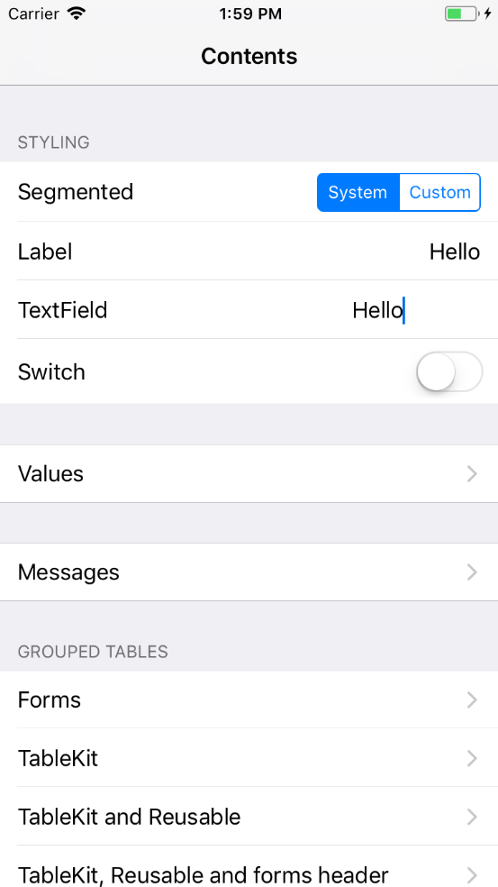

## Demo Example

This app shows how you can use the utilities provided by Form and how they will look like.

The main screen is built using a [FormView](../../Documentation/Forms.md) and lists some of the features of the framework in a table-like view with multiple sections containing different row types. Check out what it takes to build such UI and add functionality to it using Form [here](Example/Contents.swift).

The segmented control reloads the app with a different styling - switching between the default and a custom mode. You can take a look at the way the custom styling is implemented [here](Example/CustomStyle.swift).

